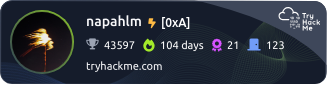

I'm a cyberneticist who likes cybersecurity and fighting games

website: [napahlm.com](https://napahlm.com)

passion project: [gribble.app](https://gribble.app)

other
- currently learning: `.cs`, `.c`, `.asm`
- familiar with: `.py`, `.js`, `.html`, `.css`, `.clj`
- tools I use for projects: `gcp`, `firebase`, `nosql`, `vuejs`, `docker`
- interesting topics: numerical optimization, red teaming, design, games

cybersecurity milestones

