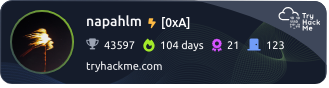

I'm a cyberneticist who likes cybersecurity and fighting games

my website: [napahlm.com](https://www.napahlm.com)

projects
- real-time chat app (auth + NoSQL): [chum chat](https://napahlm.github.io/chum-chat/)
- SQP thrust allocation (convexified nonlinear optimization): [thrust allocation](https://thrust-allocation-f3fcc.web.app/)

other
- currently learning: `.cs`, `.c`
- familiar with: `.py`, `.js`, `.html`, `.css`
- tools I use: `gcp`, `firebase`, `nosql`, `vuejs`, `docker`
- interesting topics: numerical optimization, red teaming, design, games

cybersecurity milestones

